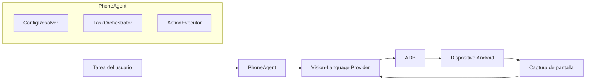

# PhoneDriver API

[](https://www.python.org/downloads/)
[](https://opensource.org/licenses/MIT)

Un agente de automatización móvil basado en Python que utiliza **APIs de Visión-Lenguaje en la nube** (Kimi, GPT-4V, Claude, etc.) para comprender e interactuar con dispositivos Android a través de análisis visual y comandos ADB.

**¡No se requiere GPU!** Este fork reemplaza el modelo local Qwen3-VL original por modelos de visión basados en API.

> ⚠️ **Aviso de seguridad y privacidad**
> - La **depuración USB** expone tu dispositivo a ataques basados en ADB. Habilítala solo mientras uses PhoneDriver-API, deshabilítala inmediatamente después y NUNCA la conectes a computadoras no confiables o estaciones de carga públicas mientras esté habilitada.
> - **Las capturas de pantalla de tu dispositivo se envían a proveedores de IA en la nube.** NO uses esta herramienta mientras haya información personal, financiera o confidencial visible en la pantalla. Revisa la política de retención de datos de tu proveedor antes de usarla.

[English](./README.md) | [简体中文](./README_CN.md) | [繁體中文](./README_TW.md) | [日本語](./README_JP.md) | [한국어](./README_KR.md) | Español

## 🧩 Visión general del proyecto

PhoneDriver-API es un agente de automatización móvil que permite controlar dispositivos Android mediante instrucciones en lenguaje natural. El sistema combina modelos de visión-lenguaje en la nube con comandos ADB para comprender la interfaz de la pantalla, planificar acciones y ejecutarlas de forma autónoma. Su valor principal es eliminar la necesidad de GPU local y ofrecer una solución accesible, flexible y multi-proveedor para la interacción automatizada con smartphones.



En el diagrama anterior, la **Tarea del usuario** entra en el **PhoneAgent**, donde los módulos internos (`ConfigResolver`, `TaskOrchestrator` y `ActionExecutor`) coordinan la ejecución. El agente consulta un **Vision-Language Provider** (Kimi, GPT-4V, Claude, etc.) enviando capturas de pantalla del dispositivo; este proveedor devuelve la acción a ejecutar, que se traduce en comandos **ADB** y se aplica al **Dispositivo Android**. La nueva captura de pantalla se reinyecta al proveedor como retroalimentación visual, cerrando el bucle de percepción-acción.

## 🌟 Características

- ☁️ **Modelos de Visión en la Nube**: Usa Kimi K2.5, GPT-4V, Claude 3.5 Sonnet u otros VLM APIs
- 🤖 **Integración ADB**: Controla dispositivos Android mediante comandos ADB
- 📝 **Tareas en lenguaje natural**: Describe lo que quieres en inglés o chino
- 🌐 **Web UI**: Interfaz Gradio integrada para un control sencillo
- 📱 **Retroalimentación en tiempo real**: Capturas de pantalla y registros de ejecución en vivo
- 🔌 **Soporte multi-proveedor**: Kimi Code, OpenRouter, Moonshot, OpenAI y más

## 📋 Requisitos

- Python 3.10+
- Dispositivo Android con depuración USB y modo desarrollador habilitados
- ADB (Android Debug Bridge) instalado
- Clave API de proveedores compatibles (Kimi Code, OpenAI, OpenRouter, etc.)

## 🚀 Inicio rápido

### 1. Instalar ADB

**Windows:**
```bash
# Descargar desde https://developer.android.com/studio/releases/platform-tools
# Añadir a PATH
```

**Linux/Ubuntu:**
```bash
sudo apt update
sudo apt install adb
```

**macOS:**
```bash
brew install android-platform-tools
```

### 2. Clonar e instalar

```bash
git clone https://github.com/Yesssssbabe/PhoneDriver-API.git
cd PhoneDriver-API

# Crear entorno virtual
python -m venv venv

# Windows
venv\Scripts\activate

# Linux/macOS
source venv/bin/activate

# Instalar dependencias
pip install -r requirements.txt
```

### 3. Configurar proveedor de API

Copiar la configuración de ejemplo y editar:

```bash
cp .env.example .env
cp config.example.json config.json
```

> **IMPORTANTE:** Asegúrate de que `.env` esté en tu `.gitignore` y NUNCA confirms las claves API en el control de versiones. Mantén tu archivo `.env` seguro y privado.

Edita `.env` con tu proveedor preferido:

**Opción A: Kimi Code (Recomendado para China)**
```env
PROVIDER=kimi_code
KIMI_CODE_API_KEY=sk-kimi-xxxxx
```

**Opción B: OpenRouter (Soporta múltiples modelos)**
```env
PROVIDER=openrouter
OPENROUTER_API_KEY=sk-or-v1-xxxxx
MODEL=moonshotai/kimi-k2.5
```

**Opción C: OpenAI**
```env
PROVIDER=openai
OPENAI_API_KEY=sk-xxxxx
MODEL=gpt-4o
```

**Opción D: Moonshot AI**
```env
PROVIDER=moonshot
MOONSHOT_API_KEY=sk-xxxxx
MODEL=kimi-k2.5
```

### 4. Conectar tu dispositivo

Habilita la depuración USB en tu dispositivo Android:
1. Ajustes → Acerca del teléfono → Toca "Número de compilación" 7 veces
2. Ajustes → Opciones de desarrollador → Habilitar "Depuración USB"
3. Conecta mediante USB y permite la depuración

Verifica la conexión:
```bash
adb devices
```

### 5. Ejecutar

**Línea de comandos:**
```bash
python phone_agent.py "Open Settings"
```

**Web UI:**
```bash
python ui.py
# Abrir http://localhost:7860
```

## 📁 Estructura del proyecto

```
PhoneDriver-API/
├── phone_agent.py          # Agente CLI principal
├── ui.py                   # Interfaz web Gradio
├── config.example.json     # Configuración de dispositivo de ejemplo
├── config.json             # Configuración de dispositivo (creada por el usuario)
├── .env                    # Claves API (crear desde .env.example)
├── requirements.txt        # Dependencias Python
├── README.md              # Documentación en inglés
├── README_CN.md           # Documentación en chino simplificado
├── README_TW.md           # Documentación en chino tradicional
├── README_JP.md           # Documentación en japonés
├── README_KR.md           # Documentación en coreano
├── README_ES.md           # Documentación en español (este archivo)
├── LICENSE                # Licencia MIT
├── providers/             # Implementaciones de proveedores API
│   ├── __init__.py
│   ├── base.py            # Interfaz base de proveedor
│   ├── kimi_code.py       # Kimi Code API
│   ├── openrouter.py      # OpenRouter API
│   ├── openai_provider.py # OpenAI API
│   └── moonshot.py        # Moonshot AI API
└── utils/                 # Funciones utilitarias
    ├── __init__.py
    ├── adb.py             # Wrapper ADB
    └── screenshot.py      # Captura de pantalla
```

## ⚙️ Configuración

### Resolución de pantalla

El agente detecta automáticamente la resolución del dispositivo. Para verificar:

```bash
adb shell wm size
```

### Proveedores soportados

| Proveedor | Modelo | Visión | Notas |
|----------|-------|--------|------|
| Kimi Code | kimi-for-coding, kimi-k2.5 | ✅ | Mejor para tareas de programación |
| OpenRouter | moonshotai/kimi-k2.5, anthropic/claude-3.5-sonnet, etc. | ✅ | Múltiples modelos |
| OpenAI | gpt-4o, gpt-4o-mini | ✅ | Confiable, mayor costo |
| Moonshot | kimi-k2.5, kimi-vl | ✅ | API oficial de Moonshot |

### Variables de entorno

| Variable | Descripción | Requerida |
|----------|-------------|----------|
| `PROVIDER` | Proveedor de API (`kimi_code`, `openrouter`, `openai`, `moonshot`) | Sí |
| `KIMI_CODE_API_KEY` | Clave API de Kimi Code | Si usa Kimi Code |
| `OPENROUTER_API_KEY` | Clave API de OpenRouter | Si usa OpenRouter |
| `OPENAI_API_KEY` | Clave API de OpenAI | Si usa OpenAI |
| `MOONSHOT_API_KEY` | Clave API de Moonshot | Si usa Moonshot |
| `MODEL` | Nombre del modelo (específico del proveedor) | Opcional |
| `TEMPERATURE` | Temperatura de muestreo (0.0–1.0) | Opcional |
| `MAX_TOKENS` | Máximo de tokens por respuesta API | Opcional |
| `MAX_RETRIES` | Intentos de reintento de API | Opcional |
| `MAX_CYCLES` | Ciclos máximos del agente por tarea | Opcional |
| `STEP_DELAY` | Retraso entre acciones (segundos) | Opcional |
| `AUTO_DETECT_RESOLUTION` | Detectar tamaño de pantalla vía ADB | Opcional |
| `CHECK_COMPLETION` | Habilitar verificación de finalización de tareas | Opcional |

## 📝 Ejemplos de uso

### Línea de comandos

```bash
# Abrir una app
python phone_agent.py "Open Chrome"

# Realizar una búsqueda
python phone_agent.py "Search for weather in New York"

# Cambiar ajustes
python phone_agent.py "Open Settings and enable WiFi"

# Tomar una foto
python phone_agent.py "Open camera and take a photo"
```

### Python API

```python
from phone_agent import PhoneAgent

config = {
    "provider": "kimi_code",
    "api_key": "your-api-key",
}

agent = PhoneAgent(config)
result = agent.execute_task("Open Settings")
print(result)
```

## 🔧 Solución de problemas

### Dispositivo no detectado

```bash
# Reiniciar servidor ADB
adb kill-server
adb start-server
adb devices
```

### Ubicaciones de toque incorrectas

La resolución se detecta automáticamente de forma predeterminada tanto en CLI como en UI. Si los toques son incorrectos, verifica con:
```bash
adb shell wm size
```
Luego configura manualmente `screen_width` y `screen_height` en `config.json`.

### Errores de API

- Verifica que tu clave API sea válida
- Comprueba si tienes cuota/créditos suficientes
- Asegúrate de que `PROVIDER` coincida con el tipo de clave API

### Errores de Unicode en Windows

Si ves `UnicodeEncodeError`, ejecuta PowerShell como UTF-8:
```powershell
[Console]::OutputEncoding = [System.Text.Encoding]::UTF8
python phone_agent.py "your task"
```

## 👥 Contribuidores

<a href="https://github.com/Yesssssbabe">
  
</a>

- **Yesssssbabe** - Creador y mantenedor ([@Yesssssbabe](https://github.com/Yesssssbabe))

## 💬 Contacto

¿Preguntas o sugerencias? ¡No dudes en contactar!

- **WeChat**: Escanea el código QR a continuación (agrega nota: **phonedriverapi**)
- **GitHub Issues**: [Crear un issue](https://github.com/Yesssssbabe/PhoneDriver-API/issues)


> **Nota:** Por favor agrega `phonedriverapi` al enviar solicitud de amistad.

## 🙏 Agradecimientos

### Contribuidores del proyecto

- **[@Yesssssbabe](https://github.com/Yesssssbabe)** - Creador y mantenedor de PhoneDriver-API

### Proyecto original

- **[@OminousIndustries](https://github.com/OminousIndustries)** - Autor original de [PhoneDriver](https://github.com/OminousIndustries/PhoneDriver)

### Proveedores de API

- [Kimi](https://kimi.com) by Moonshot AI
- [OpenRouter](https://openrouter.ai) para acceso unificado a APIs

## 📄 Licencia

MIT License - ver archivo [LICENSE](LICENSE) para detalles.

## 🤝 Contribuir

¡Las contribuciones son bienvenidas! Consulta [CONTRIBUTING.md](CONTRIBUTING.md) para más detalles.

## 💡 Mejoras futuras

- [ ] Soporte para más proveedores (Anthropic, Google Gemini, etc.)
- [ ] Procesamiento por lotes de tareas
- [ ] Grabación y reproducción de tareas
- [ ] Soporte para iOS (vía WebDriverAgent)
- [ ] Coordinación multi-dispositivo

## 🐛 Mejoras recientes

- Agregado `config.example.json` y detección automática de resolución de pantalla
- Refactorizado el código de proveedores para reducir duplicación y agregar lógica de reintento de API
- Corregido el escape de entrada de texto usando `shlex.quote` con respaldo de portapapeles
- Corregido el guardado de capturas de pantalla PNG (`optimize=True` en lugar de `quality` no soportado)
- Agregada verificación de finalización de tareas y límite de historial de acciones
- Mejorada la interpretación de `adb devices` para identificación de dispositivos

---

⭐ **¡Dale Star a este repo si te resulta útil!**
