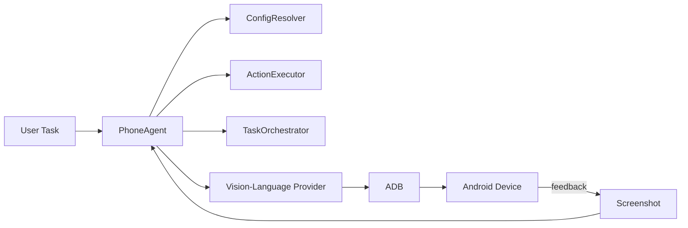

# PhoneDriver API

[](https://www.python.org/downloads/)
[](https://opensource.org/licenses/MIT)

**クラウド Vision-Language API**（Kimi、GPT-4V、Claude など）を使用して、視覚分析と ADB コマンドを通じて Android デバイスを理解し、操作する Python ベースのモバイル自動化エージェントです。

**GPU は不要です！** このフォークは、元のローカル Qwen3-VL モデルを API ベースのビジョンモデルに置き換えています。

> ⚠️ **セキュリティとプライバシーに関する注意**
> - **USB デバッグ**は、デバイスを ADB ベースの攻撃に晒します。PhoneDriver-API を使用している間のみ有効にし、使用後は直ちに無効にしてください。有効な間は、信頼できないコンピューターや公共の充電ステーションに接続しないでください。
> - **デバイスのスクリーンショットはクラウド AI プロバイダーに送信されます。** 画面に機密性の高い個人情報、財務情報、または機密情報が表示されている場合は、このツールを使用しないでください。使用前にプロバイダーのデータ保持ポリシーを確認してください。

[English](./README.md) | [简体中文](./README_CN.md) | [繁體中文](./README_TW.md) | 日本語 | [한국어](./README_KR.md) | [Español](./README_ES.md)

## 📖 プロジェクト概要 / はじめに

PhoneDriver-APIは、クラウドのVision-Language APIを活用し、自然言語で指定されたタスクをAndroidデバイス上で自動実行するモバイル自動化エージェントです。スクリーンショットの視覚解析とADBコマンドを組み合わせることで、ローカルGPUを必要とせずにスマートフォン操作を自動化できます。



上記の図は、ユーザーのタスクがPhoneAgentの各モジュールを経由してVision-Language Providerに渡され、ADBコマンドでAndroidデバイスを操作し、取得したスクリーンショットをフィードバックとして繰り返し処理するワークフローを示しています。英語のラベルはMermaid表記を簡潔にするために使用しています。

## 🌟 特徴

- ☁️ **クラウドビジョンモデル**：Kimi K2.5、GPT-4V、Claude 3.5 Sonnet、その他の VLM API を使用
- 🤖 **ADB 統合**：ADB コマンドによる Android デバイス制御
- 📝 **自然言語タスク**：英語や中国語でシンプルに目的を記述
- 🌐 **Web UI**：簡単に操作できる Gradio インターフェース
- 📱 **リアルタイムフィードバック**：ライブスクリーンショットと実行ログ
- 🔌 **マルチプロバイダ対応**：Kimi Code、OpenRouter、Moonshot、OpenAI など

## 📋 必要条件

- Python 3.10+
- USB デバッグと開発者モードが有効な Android デバイス
- インストール済みの ADB（Android Debug Bridge）
- 対応プロバイダーの API キー（Kimi Code、OpenAI、OpenRouter など）

## 🚀 クイックスタート

### 1. ADB のインストール

**Windows：**
```bash
# https://developer.android.com/studio/releases/platform-tools からダウンロード
# PATH に追加
```

**Linux/Ubuntu：**
```bash
sudo apt update
sudo apt install adb
```

**macOS：**
```bash
brew install android-platform-tools
```

### 2. クローンとインストール

```bash
git clone https://github.com/Yesssssbabe/PhoneDriver-API.git
cd PhoneDriver-API

# 仮想環境の作成
python -m venv venv

# Windows
venv\Scripts\activate

# Linux/macOS
source venv/bin/activate

# 依存関係のインストール
pip install -r requirements.txt
```

### 3. API プロバイダーの設定

サンプル設定をコピーして編集：

```bash
cp .env.example .env
cp config.example.json config.json
```

> **重要：** `.env` が `.gitignore` に含まれていることを確認し、API キーをバージョン管理に決してコミットしないでください。`.env` ファイルは安全に保管してください。

お好みのプロバイダーで `.env` を編集：

**オプション A: Kimi Code（中国ユーザーに推奨）**
```env
PROVIDER=kimi_code
KIMI_CODE_API_KEY=sk-kimi-xxxxx
```

**オプション B: OpenRouter（複数モデル対応）**
```env
PROVIDER=openrouter
OPENROUTER_API_KEY=sk-or-v1-xxxxx
MODEL=moonshotai/kimi-k2.5
```

**オプション C: OpenAI**
```env
PROVIDER=openai
OPENAI_API_KEY=sk-xxxxx
MODEL=gpt-4o
```

**オプション D: Moonshot AI**
```env
PROVIDER=moonshot
MOONSHOT_API_KEY=sk-xxxxx
MODEL=kimi-k2.5
```

### 4. デバイスの接続

Android デバイスで USB デバッグを有効化：
1. 設定 → 端末情報 → 「ビルド番号」を 7 回タップ
2. 設定 → 開発者向けオプション → 「USB デバッグ」を有効化
3. USB で接続し、デバッグを許可

接続確認：
```bash
adb devices
```

### 5. 実行

**コマンドライン：**
```bash
python phone_agent.py "Open Settings"
```

**Web UI：**
```bash
python ui.py
# http://localhost:7860 を開く
```

## 📁 プロジェクト構成

```
PhoneDriver-API/
├── phone_agent.py          # メイン CLI エージェント
├── ui.py                   # Gradio Web インターフェース
├── config.example.json     # デバイス設定のサンプル
├── config.json             # ユーザー作成のデバイス設定
├── .env                    # API キー（.env.example から作成）
├── requirements.txt        # Python 依存関係
├── README.md              # 英語ドキュメント
├── README_CN.md           # 簡体中国語ドキュメント
├── README_TW.md           # 繁体中国語ドキュメント
├── README_JP.md           # 日本語ドキュメント（このファイル）
├── LICENSE                # MIT ライセンス
├── providers/             # API プロバイダー実装
│   ├── __init__.py
│   ├── base.py            # 基本プロバイダーインターフェース
│   ├── kimi_code.py       # Kimi Code API
│   ├── openrouter.py      # OpenRouter API
│   ├── openai_provider.py # OpenAI API
│   └── moonshot.py        # Moonshot AI API
└── utils/                 # ユーティリティ関数
    ├── __init__.py
    ├── adb.py             # ADB ラッパー
    └── screenshot.py      # スクリーンショット取得
```

## ⚙️ 設定

### 画面解像度

エージェントはデバイスの解像度を自動検出します。確認するには：

```bash
adb shell wm size
```

### 対応プロバイダー

| プロバイダー | モデル | ビジョン | 備考 |
|----------|-------|--------|------|
| Kimi Code | kimi-for-coding, kimi-k2.5 | ✅ | コーディングタスクに最適 |
| OpenRouter | moonshotai/kimi-k2.5, anthropic/claude-3.5-sonnet など | ✅ | 複数モデル |
| OpenAI | gpt-4o, gpt-4o-mini | ✅ | 安定、コストが高め |
| Moonshot | kimi-k2.5, kimi-vl | ✅ | 公式 Moonshot API |

### 環境変数

| 変数 | 説明 | 必須 |
|----------|-------------|----------|
| `PROVIDER` | API プロバイダー（`kimi_code`, `openrouter`, `openai`, `moonshot`） | はい |
| `KIMI_CODE_API_KEY` | Kimi Code API キー | Kimi Code 使用時 |
| `OPENROUTER_API_KEY` | OpenRouter API キー | OpenRouter 使用時 |
| `OPENAI_API_KEY` | OpenAI API キー | OpenAI 使用時 |
| `MOONSHOT_API_KEY` | Moonshot API キー | Moonshot 使用時 |
| `MODEL` | モデル名（プロバイダー固有） | オプション |
| `TEMPERATURE` | サンプリング温度（0.0–1.0） | オプション |
| `MAX_TOKENS` | API 応答の最大トークン数 | オプション |
| `MAX_RETRIES` | API 呼び出しの再試行回数 | オプション |
| `MAX_CYCLES` | タスクあたりの最大実行サイクル数 | オプション |
| `STEP_DELAY` | アクション間の待機時間（秒） | オプション |
| `AUTO_DETECT_RESOLUTION` | ADB による画面サイズの自動検出 | オプション |
| `CHECK_COMPLETION` | タスク完了チェックの有効化 | オプション |

## 📝 使用例

### コマンドライン

```bash
# アプリを開く
python phone_agent.py "Open Chrome"

# 検索を実行
python phone_agent.py "Search for weather in New York"

# 設定を変更
python phone_agent.py "Open Settings and enable WiFi"

# 写真を撮る
python phone_agent.py "Open camera and take a photo"
```

### Python API

```python
from phone_agent import PhoneAgent

config = {
    "provider": "kimi_code",
    "api_key": "your-api-key",
}

agent = PhoneAgent(config)
result = agent.execute_task("Open Settings")
print(result)
```

## 🔧 トラブルシューティング

### デバイスが検出されない

```bash
# ADB サーバーの再起動
adb kill-server
adb start-server
adb devices
```

### タップ位置がずれる

CLI と UI の両方で、解像度はデフォルトで自動検出されます。タップ位置が正しくない場合は、以下のコマンドで確認してください：
```bash
adb shell wm size
```
その後、`config.json` で `screen_width` と `screen_height` を手動で設定してください。

### API エラー

- API キーが有効か確認
- クォータ/クレジットが十分か確認
- `PROVIDER` が API キーの種類と一致しているか確認

### Windows での Unicode ログエラー

`UnicodeEncodeError` が発生した場合、UTF-8 モードで PowerShell を実行：
```powershell
[Console]::OutputEncoding = [System.Text.Encoding]::UTF8
python phone_agent.py "your task"
```

## 👥 コントリビューター

<a href="https://github.com/Yesssssbabe">
  
</a>

- **Yesssssbabe** - 作成者兼メンテナー ([@Yesssssbabe](https://github.com/Yesssssbabe))

## 💬 連絡先

質問や提案がありますか？お気軽にご連絡ください！

- **WeChat**: 下の QR コードをスキャン（友達追加時に **phonedriverapi** と記載）
- **GitHub Issues**: [Issue を作成](https://github.com/Yesssssbabe/PhoneDriver-API/issues)


> **注意：** 友達申請時に `phonedriverapi` と添えてください。

## 🙏 謝辞

### プロジェクト貢献者

- **[@Yesssssbabe](https://github.com/Yesssssbabe)** - PhoneDriver-API の作成者兼メンテナー

### 元プロジェクト

- **[@OminousIndustries](https://github.com/OminousIndustries)** - オリジナル [PhoneDriver](https://github.com/OminousIndustries/PhoneDriver) 作者

### API プロバイダー

- [Kimi](https://kimi.com) by Moonshot AI
- [OpenRouter](https://openrouter.ai) による統一 API アクセス

## 📄 ライセンス

MIT License - 詳細は [LICENSE](LICENSE) ファイルを参照。

## 🤝 コントリビューション

コントリビューションを歓迎します！詳細は [CONTRIBUTING.md](CONTRIBUTING.md) を参照してください。

## 💡 今後の改善

- [ ] より多くのプロバイダー対応（Anthropic、Google Gemini など）
- [ ] バッチタスク処理
- [ ] タスクの録画と再生
- [ ] iOS 対応（WebDriverAgent 経由）
- [ ] マルチデバイス連携

## 🐛 最近の改善

- `config.example.json` と自動画面解像度検出を追加
- プロバイダーコードをリファクタリングし、重複を減らして API 再試行ロジックを追加
- `shlex.quote` を使用してテキスト入力のエスケープを修正し、クリップボードフォールバックを追加
- PNG スクリーンショット保存パラメータを修正（未対応の `quality` の代わりに `optimize=True`）
- タスク完了チェックを追加し、アクション履歴の長さを制限
- `adb devices` のデバイス識別解析を改善

---

⭐ **このリポジトリが役に立ったら、Star をお願いします！**
