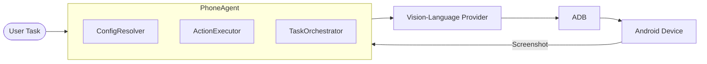

# PhoneDriver API

[](https://www.python.org/downloads/)
[](https://opensource.org/licenses/MIT)

**클우드 Vision-Language API**(Kimi, GPT-4V, Claude 등)를 사용하여 시각적 분석과 ADB 명령을 통해 Android 기기를 이해하고 상호작용하는 Python 기반 모바일 자동화 에이전트입니다.

**GPU가 필요 없습니다!** 이 포크는 원래의 로컬 Qwen3-VL 모델을 API 기반 비전 모델로 대체합니다.

> ⚠️ **보안 및 개인정보 보호 알림**
> - **USB 디버깅**은 기기를 ADB 기반 공격에 노출시킵니다. PhoneDriver-API를 actively 사용하는 동안에만 활성화하고, 사용 후 즉시 비활성화하세요. 활성화된 상태에서는 신뢰할 수 없는 컴퓨터나 공공 충전소에 연결하지 마세요.
> - **기기의 스크린샷이 클라우드 AI 공급자에게 전송됩니다.** 화면에 민감한 개인, 금융 또는 기밀 정보가 표시되어 있을 때는 이 도구를 사용하지 마세요. 사용 전 공급자의 데이터 보존 정책을 검토하세요.

[English](./README.md) | [简体中文](./README_CN.md) | [繁體中文](./README_TW.md) | [日本語](./README_JP.md) | 한국어 | [Español](./README_ES.md)

## 🎯 프로젝트 개요

PhoneDriver-API는 자연어로 설명된 작업을 받아 Vision-Language 모델의 시각적 분석과 ADB 명령을 결합하여 Android 기기를 자율적으로 제어하는 Python 기반 모바일 에이전트입니다. 별도의 GPU 없이도 클라우드 VLM API를 활용해 스마트폰 화면을 읽고, 적절한 동작을 결정하며, 실제 기기에서 실행합니다. 이를 통해 복잡한 모바일 워크플로우를 몇 문장의 지시만으로 자동화할 수 있습니다.

### 아키텍처 개요

아래 다이어그램은 PhoneDriver-API의 전체 흐름을 보여줍니다. 노드 레이블은 기술 용어를 그대로 사용하고, 각 구성 요소에 대한 한국어 설명은 하단에 추가했습니다.



- **User Task**: 사용자가 자연어로 입력한 작업입니다.
- **PhoneAgent**: 설정 해석(ConfigResolver), 동작 실행(ActionExecutor), 작업 조율(TaskOrchestrator)로 구성된 핵심 에이전트입니다.
- **Vision-Language Provider**: Kimi, GPT-4V, Claude 등의 클라우드 VLM API입니다.
- **ADB**: Android Debug Bridge를 통해 기기에 명령을 전달합니다.
- **Android Device**: 실제 제어되는 Android 기기이며, 캡처된 스크린샷이 PhoneAgent로 피드백되어 다음 동작을 결정합니다.

## 🌟 기능

- ☁️ **클라우드 비전 모델**: Kimi K2.5, GPT-4V, Claude 3.5 Sonnet 또는 기타 VLM API 사용
- 🤖 **ADB 통합**: ADB 명령으로 Android 기기 제어
- 📝 **자연어 작업**: 영어 또는 중국어로 간단히 원하는 것을 설명
- 🌐 **Web UI**: 쉽게 제어할 수 있는 Gradio 인터페이스
- 📱 **실시간 피드백**: 실시간 스크린샷과 실행 로그
- 🔌 **다중 공급자 지원**: Kimi Code, OpenRouter, Moonshot, OpenAI 등

## 📋 요구사항

- Python 3.10+
- USB 디버깅 및 개발자 모드가 활성화된 Android 기기
- 설치된 ADB (Android Debug Bridge)
- 지원 공급자의 API 키 (Kimi Code, OpenAI, OpenRouter 등)

## 🚀 빠른 시작

### 1. ADB 설치

**Windows:**
```bash
# https://developer.android.com/studio/releases/platform-tools 에서 다운로드
# PATH에 추가
```

**Linux/Ubuntu:**
```bash
sudo apt update
sudo apt install adb
```

**macOS:**
```bash
brew install android-platform-tools
```

### 2. 클론 및 설치

```bash
git clone https://github.com/Yesssssbabe/PhoneDriver-API.git
cd PhoneDriver-API

# 가상 환경 생성
python -m venv venv

# Windows
venv\Scripts\activate

# Linux/macOS
source venv/bin/activate

# 의존성 설치
pip install -r requirements.txt
```

### 3. API 공급자 구성

예제 설정을 복사하고 편집:

```bash
cp .env.example .env
cp config.example.json config.json
```

> **중요:** `.env`가 `.gitignore`에 포함되어 있는지 확인하고 API 키를 버전 관리에 절대 커밋하지 마세요. `.env` 파일은 안전하게 보관하세요.

선호하는 공급자로 `.env`를 편집:

**옵션 A: Kimi Code (중국 사용자 권장)**
```env
PROVIDER=kimi_code
KIMI_CODE_API_KEY=sk-kimi-xxxxx
```

**옵션 B: OpenRouter (여러 모델 지원)**
```env
PROVIDER=openrouter
OPENROUTER_API_KEY=sk-or-v1-xxxxx
MODEL=moonshotai/kimi-k2.5
```

**옵션 C: OpenAI**
```env
PROVIDER=openai
OPENAI_API_KEY=sk-xxxxx
MODEL=gpt-4o
```

**옵션 D: Moonshot AI**
```env
PROVIDER=moonshot
MOONSHOT_API_KEY=sk-xxxxx
MODEL=kimi-k2.5
```

### 4. 기기 연결

Android 기기에서 USB 디버깅 활성화:
1. 설정 → 휴전화 정보 → "빌드 번호"를 7번 탭
2. 설정 → 개발자 옵션 → "USB 디버깅" 활성화
3. USB로 연결하고 디버깅 허용

연결 확인:
```bash
adb devices
```

### 5. 실행

**명령줄:**
```bash
python phone_agent.py "Open Settings"
```

**Web UI:**
```bash
python ui.py
# http://localhost:7860 열기
```

## 📁 프로젝트 구조

```
PhoneDriver-API/
├── phone_agent.py          # 메인 CLI 에이전트
├── ui.py                   # Gradio 웹 인터페이스
├── config.example.json     # 기기 설정 예제
├── config.json             # 사용자가 생성한 기기 설정
├── .env                    # API 키 (.env.example에서 생성)
├── requirements.txt        # Python 의존성
├── README.md              # 영문 문서
├── README_CN.md           # 중국어 간체 문서
├── README_TW.md           # 중국어 번체 문서
├── README_JP.md           # 일본어 문서
├── README_KR.md           # 한국어 문서 (이 파일)
├── LICENSE                # MIT 라이선스
├── providers/             # API 공급자 구현
│   ├── __init__.py
│   ├── base.py            # 기본 공급자 인터페이스
│   ├── kimi_code.py       # Kimi Code API
│   ├── openrouter.py      # OpenRouter API
│   ├── openai_provider.py # OpenAI API
│   └── moonshot.py        # Moonshot AI API
└── utils/                 # 유틸리티 함수
    ├── __init__.py
    ├── adb.py             # ADB 래퍼
    └── screenshot.py      # 스크린샷 캡처
```

## ⚙️ 구성

### 화면 해상도

에이전트가 기기 해상도를 자동으로 감지합니다. 확인하려면:

```bash
adb shell wm size
```

### 지원 공급자

| 공급자 | 모델 | 비전 | 참고 |
|----------|-------|--------|------|
| Kimi Code | kimi-for-coding, kimi-k2.5 | ✅ | 코딩 작업에 가장 적합 |
| OpenRouter | moonshotai/kimi-k2.5, anthropic/claude-3.5-sonnet 등 | ✅ | 여러 모델 |
| OpenAI | gpt-4o, gpt-4o-mini | ✅ | 안정적, 비용 높음 |
| Moonshot | kimi-k2.5, kimi-vl | ✅ | 공식 Moonshot API |

### 환경 변수

| 변수 | 설명 | 필수 |
|----------|-------------|----------|
| `PROVIDER` | API 공급자 (`kimi_code`, `openrouter`, `openai`, `moonshot`) | 예 |
| `KIMI_CODE_API_KEY` | Kimi Code API 키 | Kimi Code 사용 시 |
| `OPENROUTER_API_KEY` | OpenRouter API 키 | OpenRouter 사용 시 |
| `OPENAI_API_KEY` | OpenAI API 키 | OpenAI 사용 시 |
| `MOONSHOT_API_KEY` | Moonshot API 키 | Moonshot 사용 시 |
| `MODEL` | 모델 이름 (공급자별) | 선택 |
| `TEMPERATURE` | 샘플링 온도 (0.0–1.0) | 선택 |
| `MAX_TOKENS` | API 응답당 최대 토큰 수 | 선택 |
| `MAX_RETRIES` | API 호출 재시도 횟수 | 선택 |
| `MAX_CYCLES` | 작업당 최대 실행 사이클 수 | 선택 |
| `STEP_DELAY` | 동작 간 지연 시간(초) | 선택 |
| `AUTO_DETECT_RESOLUTION` | ADB를 통한 화면 크기 자동 감지 | 선택 |
| `CHECK_COMPLETION` | 작업 완료 검사 활성화 | 선택 |

## 📝 사용 예시

### 명령줄

```bash
# 앱 열기
python phone_agent.py "Open Chrome"

# 검색 수행
python phone_agent.py "Search for weather in New York"

# 설정 변경
python phone_agent.py "Open Settings and enable WiFi"

# 사진 찍기
python phone_agent.py "Open camera and take a photo"
```

### Python API

```python
from phone_agent import PhoneAgent

config = {
    "provider": "kimi_code",
    "api_key": "your-api-key",
}

agent = PhoneAgent(config)
result = agent.execute_task("Open Settings")
print(result)
```

## 🔧 문제 해결

### 기기가 감지되지 않음

```bash
# ADB 서버 재시작
adb kill-server
adb start-server
adb devices
```

### 탭 위치가 잘못됨

CLI와 UI 모두에서 해상도는 기본적으로 자동 감지됩니다. 탭 위치가 올바르지 않은 경우 다음 명령으로 확인하세요:
```bash
adb shell wm size
```
그런 다음 `config.json`에서 `screen_width`와 `screen_height`를 수동으로 설정하세요.

### API 오류

- API 키가 유효한지 확인
- 할당량/크레딧이 충분한지 확인
- `PROVIDER`가 API 키 유형과 일치하는지 확인

### Windows에서 Unicode 로그 오류

`UnicodeEncodeError`가 발생하면 UTF-8 모드로 PowerShell 실행:
```powershell
[Console]::OutputEncoding = [System.Text.Encoding]::UTF8
python phone_agent.py "your task"
```

## 👥 기여자

<a href="https://github.com/Yesssssbabe">
  
</a>

- **Yesssssbabe** - 제작자 및 유지관리자 ([@Yesssssbabe](https://github.com/Yesssssbabe))

## 💬 연락처

질문이나 제안이 있으신가요? 언제든지 연락 주세요!

- **WeChat**: 아래 QR 코드 스캔 (친구 추가 시 **phonedriverapi** 기재)
- **GitHub Issues**: [Issue 생성](https://github.com/Yesssssbabe/PhoneDriver-API/issues)


> **참고:** 친구 요청 시 `phonedriverapi`를 적어주세요.

## 🙏 감사의 글

### 프로젝트 기여자

- **[@Yesssssbabe](https://github.com/Yesssssbabe)** - PhoneDriver-API 제작자 및 유지관리자

### 원본 프로젝트

- **[@OminousIndustries](https://github.com/OminousIndustries)** - 원본 [PhoneDriver](https://github.com/OminousIndustries/PhoneDriver) 작성자

### API 공급자

- [Kimi](https://kimi.com) by Moonshot AI
- [OpenRouter](https://openrouter.ai) 통합 API 액세스

## 📄 라이선스

MIT License - 자세한 내용은 [LICENSE](LICENSE) 파일 참조.

## 🤝 기여

기여를 환영합니다! 자세한 내용은 [CONTRIBUTING.md](CONTRIBUTING.md)를 참조하세요.

## 💡 향후 개선

- [ ] 더 많은 공급자 지원 (Anthropic, Google Gemini 등)
- [ ] 배치 작업 처리
- [ ] 작업 녹화 및 재생
- [ ] iOS 지원 (WebDriverAgent 통해)
- [ ] 다중 기기 조정

## 🐛 최근 개선

- `config.example.json` 및 자동 화면 해상도 감지 추가
- 공급자 코드 리팩토링, 중복 감소 및 API 재시도 로직 추가
- `shlex.quote`를 사용하여 텍스트 입력 이스케이프 수정 및 클립보드 폴back 추가
- PNG 스크린샷 저장 매개변수 수정 (지원되지 않는 `quality` 대신 `optimize=True` 사용)
- 작업 완료 검사 추가 및 동작 기록 길이 제한
- `adb devices` 기기 식별 파싱 개선

---

⭐ **이 리포지토리가 유용하다면 Star를 눌러주세요!**
