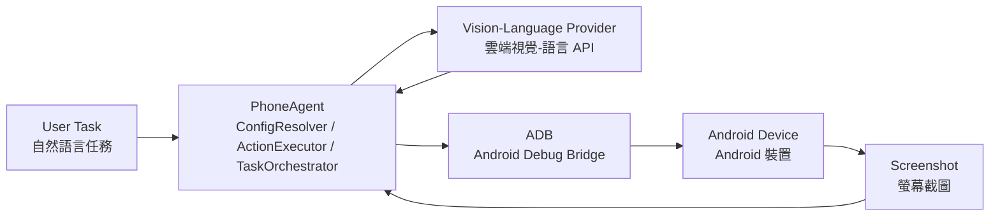

# PhoneDriver API

[](https://www.python.org/downloads/)
[](https://opensource.org/licenses/MIT)

一款基於 Python 的行動裝置自動化代理，使用**雲端視覺-語言 API**（Kimi、GPT-4V、Claude 等）透過視覺分析與 ADB 指令來理解並與 Android 裝置互動。

**無需 GPU！** 此分支將原本的本地 Qwen3-VL 模型替換為基於 API 的視覺模型。

> ⚠️ **安全與隱私提示**
> - **USB 偵錯**會使裝置暴露於 ADB 攻擊。僅在 actively 使用 PhoneDriver-API 時啟用，使用完畢後立即關閉，且啟用期間切勿連接不可信的電腦或公共充電站。
> - **裝置截圖會被傳送至雲端 AI 供應商。** 當螢幕上顯示敏感的個人、財務或機密資訊時，請勿使用本工具。使用前請查看供應商的資料保留政策。

[English](./README.md) | [简体中文](./README_CN.md) | 繁體中文 | [日本語](./README_JP.md) | [한국어](./README_KR.md) | [Español](./README_ES.md)

## 🎯 專案概述

PhoneDriver-API 是一款基於 Python 的行動裝置自動化代理，透過整合雲端視覺-語言模型與 ADB 指令，讓使用者能以自然語言驅動 Android 裝置完成各種操作。其核心價值在於無需本地 GPU 即可運行，只需提供 API 金鑰，就能將大語言模型的視覺理解能力轉化為實際的裝置自動化執行力。

### 運作流程圖



圖中各節點英文標籤說明如下：`User Task` 為使用者輸入的自然語言任務；`PhoneAgent` 負責解析設定、執行動作與協調任務；`Vision-Language Provider` 為提供視覺理解能力的雲端 API；`ADB` 透過 Android Debug Bridge 與裝置通訊；`Screenshot` 則作為視覺回饋，讓代理能持續觀察並調整下一步動作。

## 🌟 功能特色

- ☁️ **雲端視覺模型**：使用 Kimi K2.5、GPT-4V、Claude 3.5 Sonnet 或其他 VLM API
- 🤖 **ADB 整合**：透過 ADB 指令控制 Android 裝置
- 📝 **自然語言任務**：用簡單的英文或中文描述你想做的事
- 🌐 **Web UI**：內建 Gradio 介面，方便操作
- 📱 **即時回饋**：即時截圖與執行日誌
- 🔌 **多供應商支援**：Kimi Code、OpenRouter、Moonshot、OpenAI 等

## 📋 系統需求

- Python 3.10+
- 開啟 USB 偵錯與開發者模式的 Android 裝置
- 已安裝 ADB (Android Debug Bridge)
- 支援供應商的 API 金鑰（Kimi Code、OpenAI、OpenRouter 等）

## 🚀 快速開始

### 1. 安裝 ADB

**Windows：**
```bash
# 從 https://developer.android.com/studio/releases/platform-tools 下載
# 加入 PATH
```

**Linux/Ubuntu：**
```bash
sudo apt update
sudo apt install adb
```

**macOS：**
```bash
brew install android-platform-tools
```

### 2. 複製並安裝

```bash
git clone https://github.com/Yesssssbabe/PhoneDriver-API.git
cd PhoneDriver-API

# 建立虛擬環境
python -m venv venv

# Windows
venv\Scripts\activate

# Linux/macOS
source venv/bin/activate

# 安裝依賴
pip install -r requirements.txt
```

### 3. 設定 API 供應商

複製範例設定並編輯：

```bash
cp .env.example .env
cp config.example.json config.json
```

> **重要：** 請確保 `.env` 已加入 `.gitignore`，切勿將 API 金鑰提交到版本控制。請妥善保管 `.env` 檔案。

編輯 `.env` 檔案，選擇你偏好的供應商：

**選項 A：Kimi Code（推薦給中國用戶）**
```env
PROVIDER=kimi_code
KIMI_CODE_API_KEY=sk-kimi-xxxxx
```

**選項 B：OpenRouter（支援多種模型）**
```env
PROVIDER=openrouter
OPENROUTER_API_KEY=sk-or-v1-xxxxx
MODEL=moonshotai/kimi-k2.5
```

**選項 C：OpenAI**
```env
PROVIDER=openai
OPENAI_API_KEY=sk-xxxxx
MODEL=gpt-4o
```

**選項 D：Moonshot AI**
```env
PROVIDER=moonshot
MOONSHOT_API_KEY=sk-xxxxx
MODEL=kimi-k2.5
```

### 4. 連接你的裝置

在 Android 裝置上啟用 USB 偵錯：
1. 設定 → 關於手機 → 輕觸「版本號碼」7 次
2. 設定 → 開發人員選項 → 啟用「USB 偵錯」
3. 透過 USB 連接並允許偵錯

驗證連線：
```bash
adb devices
```

### 5. 執行

**命令列：**
```bash
python phone_agent.py "Open Settings"
```

**Web UI：**
```bash
python ui.py
# 開啟 http://localhost:7860
```

## 📁 專案結構

```
PhoneDriver-API/
├── phone_agent.py          # 主 CLI 代理
├── ui.py                   # Gradio 網頁介面
├── config.example.json     # 裝置設定範例
├── config.json             # 裝置設定（由使用者建立）
├── .env                    # API 金鑰（從 .env.example 建立）
├── requirements.txt        # Python 依賴
├── README.md              # 英文文件
├── README_CN.md           # 簡體中文文件
├── README_TW.md           # 繁體中文文件（本文件）
├── README_JP.md           # 日文文件
├── README_KR.md           # 韓文文件
├── README_ES.md           # 西班牙語文件
├── LICENSE                # MIT 授權
├── providers/             # API 供應商實作
│   ├── __init__.py
│   ├── base.py            # 基礎供應商介面
│   ├── kimi_code.py       # Kimi Code API
│   ├── openrouter.py      # OpenRouter API
│   ├── openai_provider.py # OpenAI API
│   └── moonshot.py        # Moonshot AI API
└── utils/                 # 工具函式
    ├── __init__.py
    ├── adb.py             # ADB 包裝器
    └── screenshot.py      # 截圖擷取
```

## ⚙️ 設定

### 螢幕解析度

代理會自動偵測裝置解析度。如要驗證：

```bash
adb shell wm size
```

### 支援的供應商

| 供應商 | 模型 | 視覺 | 備註 |
|----------|-------|--------|------|
| Kimi Code | kimi-for-coding, kimi-k2.5 | ✅ | 最適合程式任務 |
| OpenRouter | moonshotai/kimi-k2.5, anthropic/claude-3.5-sonnet 等 | ✅ | 多種模型 |
| OpenAI | gpt-4o, gpt-4o-mini | ✅ | 穩定，成本較高 |
| Moonshot | kimi-k2.5, kimi-vl | ✅ | 官方 Moonshot API |

### 環境變數

| 變數 | 說明 | 必要 |
|----------|-------------|----------|
| `PROVIDER` | API 供應商（`kimi_code`, `openrouter`, `openai`, `moonshot`） | 是 |
| `KIMI_CODE_API_KEY` | Kimi Code API 金鑰 | 使用 Kimi Code 時 |
| `OPENROUTER_API_KEY` | OpenRouter API 金鑰 | 使用 OpenRouter 時 |
| `OPENAI_API_KEY` | OpenAI API 金鑰 | 使用 OpenAI 時 |
| `MOONSHOT_API_KEY` | Moonshot API 金鑰 | 使用 Moonshot 時 |
| `MODEL` | 模型名稱（供應商特定） | 選用 |
| `TEMPERATURE` | 取樣溫度（0.0–1.0） | 選用 |
| `MAX_TOKENS` | 每次 API 回應的最大 token 數 | 選用 |
| `MAX_RETRIES` | API 呼叫重試次數 | 選用 |
| `MAX_CYCLES` | 每個任務的最大執行輪數 | 選用 |
| `STEP_DELAY` | 動作間隔（秒） | 選用 |
| `AUTO_DETECT_RESOLUTION` | 透過 ADB 自動偵測螢幕尺寸 | 選用 |
| `CHECK_COMPLETION` | 啟用任務完成檢查 | 選用 |

## 📝 使用範例

### 命令列

```bash
# 開啟應用程式
python phone_agent.py "Open Chrome"

# 執行搜尋
python phone_agent.py "Search for weather in New York"

# 更改設定
python phone_agent.py "Open Settings and enable WiFi"

# 拍照
python phone_agent.py "Open camera and take a photo"
```

### Python API

```python
from phone_agent import PhoneAgent

config = {
    "provider": "kimi_code",
    "api_key": "your-api-key",
}

agent = PhoneAgent(config)
result = agent.execute_task("Open Settings")
print(result)
```

## 🔧 疑難排解

### 裝置未被偵測

```bash
# 重新啟動 ADB 伺服器
adb kill-server
adb start-server
adb devices
```

### 點擊位置錯誤

CLI 和 UI 預設都會自動偵測解析度。如果點擊位置不正確，請透過以下命令驗證：
```bash
adb shell wm size
```
然後在 `config.json` 中手動設定 `screen_width` 和 `screen_height`。

### API 錯誤

- 驗證你的 API 金鑰是否有效
- 檢查你是否還有足夠的額度/點數
- 確保 `PROVIDER` 與 API 金鑰類型相符

### Windows 上的 Unicode 日誌錯誤

如果看到 `UnicodeEncodeError`，以 UTF-8 模式執行 PowerShell：
```powershell
[Console]::OutputEncoding = [System.Text.Encoding]::UTF8
python phone_agent.py "your task"
```

## 👥 貢獻者

<a href="https://github.com/Yesssssbabe">
  
</a>

- **Yesssssbabe** - 創建者與維護者 ([@Yesssssbabe](https://github.com/Yesssssbabe))

## 💬 聯絡方式

有問題或建議？歡迎聯絡！

- **微信**：掃描下方 QR code（加好友備註：**phonedriverapi**）
- **GitHub Issues**：[建立 Issue](https://github.com/Yesssssbabe/PhoneDriver-API/issues)


> **注意：** 加好友時請備註 `phonedriverapi`。

## 🙏 致謝

### 專案貢獻者

- **[@Yesssssbabe](https://github.com/Yesssssbabe)** - PhoneDriver-API 的創建者與維護者

### 原專案

- **[@OminousIndustries](https://github.com/OminousIndustries)** - 原版 [PhoneDriver](https://github.com/OminousIndustries/PhoneDriver) 作者

### API 供應商

- [Kimi](https://kimi.com) by Moonshot AI
- [OpenRouter](https://openrouter.ai) 提供統一 API 存取

## 📄 授權

MIT License - 詳見 [LICENSE](LICENSE) 檔案。

## 🤝 貢獻

歡迎貢獻！請參閱 [CONTRIBUTING.md](CONTRIBUTING.md) 了解詳情。

## 💡 未來改進

- [ ] 支援更多供應商（Anthropic、Google Gemini 等）
- [ ] 批次任務處理
- [ ] 任務錄製與回放
- [ ] iOS 支援（透過 WebDriverAgent）
- [ ] 多裝置協調

## 🐛 近期改進

- 新增 `config.example.json` 與自動螢幕解析度偵測
- 重構 provider 程式碼，減少重複並增加 API 重試機制
- 使用 `shlex.quote` 修復文字輸入轉義，並增加剪貼簿備用方案
- 修復 PNG 截圖儲存參數（使用 `optimize=True` 替代不支援的 `quality`）
- 新增任務完成檢查並限制動作歷史長度
- 改進 `adb devices` 裝置識別解析

---

⭐ **如果覺得這個專案有用，請給個 Star！**
